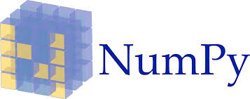

# COVID-19 Face Mask Detection

Face and mask detection using CNN

## Requirement

- TensorFlow 2+
- OpenCV
- numpy
- matplotlib
- winsound

## TensorFlow 2+

**tensorflow.keras.applications.mobilenetv2  preprocess_input**

- from tensorflow.keras.applications.mobilenetv2

MobileNetV2 아키텍처를 인스턴스화
↓
tf.keras.applications.MobileNetV2(
    input_shape=None,
    alpha=1.0,
    include_top=True,
    weights="imagenet",
    input_tensor=None,
    pooling=None,
    classes=1000,
    classifier_activation="softmax",
    kwargs
   )
Keras 용 MobileNet v2 모델.

MobileNetV2는 일반 아키텍처이며 여러 사용 사례에 사용할 수 있습니다. 사용 사례에 따라 다른 입력 레이어 크기와 다른 너비 요소를 사용할 수 있습니다. 이를 통해 서로 다른 너비 모델이 곱셈 추가 횟수를 줄여 모바일 장치의 추론 비용을 줄일 수 있습니다. 
-> 연산비용 낮음

MobileNets는 32 x 32보다 큰 모든 입력 크기를 지원하며 더 큰 이미지 크기는 더 나은 성능을 제공합니다.
-> 모바일 넷은 입력데이터 레이어의 크기가 클수록 좋은 성능을 제공한다

매개 변수의 수와 곱하기 더하기의 수는 각 레이어의 필터 수를 증가 / 감소시키는 alpha 매개 변수를 사용하여 수정할 수 있습니다. 이미지 크기와 알파 매개 변수를 변경하면 ImageNet 가중치가 제공되어 종이에 있는 22 개 모델을 모두 만들 수 있습니다.

- process_input
  모델의 입력에 맞게 이미지 배치를 인코딩하는 텐서 또는 Numpy 배열을 전처리합니다.

**load_model**

load_model : 학습된 Keras 모델을 불러오고 인퍼런스를 위해 준비하는데 사용합니다. 미리 학습된 Keras 모델을 불러옵니다(여기서 우리는 ImageNet으로 학습되고 
Keras에서 제공하는 모델을 사용합니다. 하지만 쉽게 하기위해 우선 load_model로 디스크에서 Keras 모델을 불러옵니다.

load_model 특징 
모델 호출은 차단 작업이며 모델을 완전히 불러올 때까지 웹서비스가 시작되지 않도록 합니다. 
웹 서비스를 시작하기 전에 모델을 메모리로 완전히 불러오고 인퍼런스를 할 준비가 되지 않았다면 
아래와 같은 상황이 발생할 수 있습니다:

1.POST형식으로 서버에 요청합니다.
2.서버가 요청을 받고 데이터를 사전 처리하고 그 데이터를 모델을 통해 전달하도록 시도합니다.
3.만약 모델을 완전히 불러오지 않았다면, 에러가 발생할 겁니다.
당신만의 Keras REST API를 설계할 때, 요청들을 승인하기 전에 인퍼런스를 위한 준비가 되었는지 모델이 불러와졌는지를 보장하는 논리가 들어가 있는지 확인하셔야 합니다.

load_model 함수
tf.keras.models.load_model(
    filepath, custom_objects=None, compile=True, options=None
)
filepath:다음 중 하나 : -String 또는 pathlib.Path 개체, 모델을로드 할 저장된 model-h5py.File 개체의 경로
custom_objects : deserialization 중에 고려할 사용자 지정 클래스 또는 함수에 대한 선택적 사전 매핑 이름 (문자열).
compile: Boolean,로드 후 모델 컴파일 여부.
options : 저장된 모델에서로드하기위한 옵션을 지정하는 선택적 tf.saved_model.LoadOptions 객체

구동방식
Keras 모델 인스턴스. 원래 모델을 컴파일하여 최적기와 함께 저장하면 반환된 모델이 컴파일된다. 
그렇지 않으면 모델은 포장되지 않은 채로 남게 된다. 
컴파일되지 않은 모델이 반환되는 경우 컴파일 인수가 True로 설정된 경우 경고가 표시된다.

## OpenCV

import cv2로 불러올 수 있는 opencv 라이브러리는 이미지, 영상처리, Object Detection, Motion Detecton 등의 기능을 지원함
기본적으로 이미지나 영상을 읽고 화면에 출력하거나 새로 저장하는 기능이 가장 기초적인 기능
최근 머신러닝에서 영상 및 사진을 통한 학습법이 계속해서 발달함에 따라 opencv라이브러리를 통해 이를 효과적으로 이용할 수 있음
예를 들어 영상 혹은 사진에서 특정 인물을 찾아야하는 프로그램(대표적으로 페이스북 얼굴인식)을 만들어야할 때 많이 사용되는 라이브러리

import cv2로 불러오는 OpenCV(Open Source Computer Vision)은 실시간 컴퓨터 비전을 목적으로 한 프로그래밍 라이브러리입니다. 실시간 이미지 프로세싱에 중점을 둔 라이브러리이며 인텔 CPU에서 사용되는 경우 속도의 향상을 볼 수 있는 IPP(Intel Performance Primitives)를 지원합니다. 인간과 컴퓨터 상호 작용 (HCI) 객체ㆍ얼굴ㆍ행동 인식 독순 모션 추적 등의/ 응용 프로그램에서 사용합니다.

OpenCV(Open Source Computer Vision)은 실시간 컴퓨터 비전을 목적으로 한 프로그래밍 라이브러리이다.
원래는 인텔이 개발하였다.
실시간 이미지 프로세싱에 중점을 둔 라이브러리이다.
인텔 CPU에서 사용되는 경우 속도의 향상을 볼 수 있는 IPP(Intel Performance Primitives)를 지원한다.
이 라이브러리는 윈도, 리눅스 등에서 사용 가능한 크로스 플랫폼이며 오픈소스 BSD 허가서 하에서 무료로 사용할 수 있다.
OpenCV는 TensorFlow , Torch / PyTorch 및 Caffe의 딥러닝 프레임워크를 지원한다. 

**응용 기술의 예**
- 인간과 컴퓨터 상호 작용 (HCI)
- 물체 인식
- 안면 인식
- 모바일 로보틱스
- 제스처 인식
- OpenCV (Open Source Computer Vision)은 오픈 소스 컴퓨터 비전 라이브러리입니다.
- 객체ㆍ얼굴ㆍ행동 인식, 독순, 모션 추적 등의 응용 프로그램에서 사용합니다.
- OpenCV 모듈은 pip를 통하여 설치할 수 있습니다.
- 설치 명령어는 python -m pip install opencv-python 입니다.

OpenCV
OpenCV는 Gary Bradsky라는 사람에 의해 1996년 인텔에서 시작된 프로젝트이며, 2000년에 첫번째 배포판이 릴리즈 되었다
이후 Vadim Pisarevsky, Stanley, Willow Garage 등 많은 사람들이 이 프로젝트를 리딩하였다.
현재는 OpenCV가 컴퓨터 비전, 머신러닝과 관련된 다양한 알고리즘을 지원하고 있으며, 하루하루 성장하고 있는 중이라고 한다.
오늘날 OpenCV는 C++, Python, Jave 등 다양한 프로그래밍 언어로 지원되고 있으며, Windows, Linux, OS X, 안드로이드, iOS 등 다양한 OS 플랫폼을 지원하고 있다.
또한 CUDA와 OpenCL에 기반한 인터페이스도 지원된다.

OpenCV-Python
OpenCV-Python은 그 이름에서 유추할 수 있듯이 OpenCV의 파이썬 API들의 모임이다.
다시 말하면 OpenCV-Python은 OpenCV의 C++ API를 파이썬 언어로 랩핑한 것이라 보면 된다.
아시다시피 파이썬은 귀도 반 로섬(Ruido van Rossum)이라는 네덜란드 프로그래머에 의해 개발된 범용 프로그래밍 언어이다.
파이썬은 간결한 프로그래밍이 가능하고 가독성 높은 코드를 작성할 수 있다는 이유로 단기간에 아주 인기 있는 언어가 되었다.
파이썬이라는 언어는 프로그래머가 생각한 아이디어를 가독성을 떨어뜨리지 않고 몇 줄 안되는 코딩으로 프로토타이핑이 가능하다.
파이썬은 스크립트 언어이기 때문에 C/C++와 같은 컴파일 언어에 비해 속도가 느리다.
하지만 파이썬의 이러한 단점을 보완할 수 있는데, 성능적인 이슈가 있는 부분은 C/C++로 구현한 후 이를 파이썬으로 불러 사용할 수 있도록 파이썬 래퍼를 생성한다.
C/C++로 구현한 코드를 C확장모듈 또는 C확장형 이라고 하고, 이 녀석을 파이썬 래퍼로 감싼 후 파이썬 모듈로 사용하는 것이다.
파이썬의 이러한 특징은 2가지면에서 우리를 즐겁게 해준다.
파이썬 코드가 C/C++로 구현한 코드에 비해 성능이 뒤떨어지지 않게 한다.
결국은 파이썬으로 로직을 짜는 것이므로, 손쉽게 프로그래밍 할 수 있다.

OpenCV는 C++로 구현되어 있다.
OpenCV-Python은 오리지널 OpenCV 라이브러리들을 파이썬 래퍼로 감싼 후, 파이썬 모듈화 시킨것이다.
OpenCV-Python은 Numpy라고 하는 수학 연산을 위해 최적화된 라이브러리를 활용하며,이와 호환되기도 한다.
Numpy를 통해 컴퓨터 그래픽스, 이미지 프로세싱, 비전 처리 등에 필요한 행렬연산을 손쉽게 할 수 있도록 한다.
Numpy는 MATLAB 스타일의 문맥(syntax)을 제공한다.
모든 OpenCV 배열 구조는 Numpy 배열로 변환되고 이를 통해 내부 처리를 수행한다.
따라서 Numpy로 할 수 있는 모든 연산은 OpenCV와 호환되어 상호 결합 가능하다.
이외에 Numpy를 활용하는 라이브러리로는 SciPy, Matplotlib과 같은 것들이 있다.
OpenCV-Python은 컴퓨터 비전에 관련한 다양한 문제를 해결하기 위한 프로토타입을 매우 빠르게 구현할 수 있는 도구이다.

## numpy

Numpy는 다차원 배열을 쉽게 처리하고 효율적으로 사용할 수있도록 지원하는 파이썬의 패키지 입니다. Numpy는 데이터 구조 외에도 수치 계산을 효율적으로 구현된 기능을 제공하며, 데이터 분석을 할 때, Pandas와 함께 자주 사용하는 도구로 등장합니다.

데이터란 이미지, 오디오, 텍스트 숫자 등 다양한 형태와 크기로 존재합니다. 사람은 이런 데이터들을 가지고 이해하지만 컴퓨터는 0 또는 1만 이해합니다. 여기서 핵심은 데이터를 숫자의 배열로 볼 수 있습니다. 실제로 데이터 분석을 수행하기 위한 전제 조건은 컴퓨터가 이해할 수 있도록 데이터를 숫자 형식으로 변환하는 것입니다. 여기서 효율적으로 배열을 저장 및 조작 할 수 있어야 Numpy 배열과 동일한 기능을 제공할 수 있기 때문에 왜 Numpy를 사용해야 하는지 의문이 듭니다.  배열의 크기가 작으면 문제가 되지 않지만 Numpy 배열은 데이터의 크기가 커질수록 저장 및 핵심적인 도구로 인식이 되고 있습니다.

## winsound

<winsound – 윈도우용 소리 재생 인터페이스>

- Import winsound
: Winsound 모듈은 윈도우 플랫폼에서 제공하는 기본 소리 재생 장치에 대한 액세스를 제공하며, 함수와 여러 상수를 포함한다.

- Winsound.Beep(frequency, duration)
: PC 스피커로 신호음을 울린다. 
: frequency 매개 변수는 소리의 주파수를 Hz 단위로 지정하며 37에서 32,767의 범위에 있어야 한다.
: duration 매개 변수는 소리의 지속 시간을 밀리 초로 지정한다.
: 시스템이 스피커에서 신호음을 울리지 못하면, RuntimeError가 발생하게 된다.
+ RuntimeError
: 다른 범주에 속하지 않는 에러가 감지될 때 발생하며, 연관된 값은 정확히 무엇이 잘못되었는지를 나타내는 문자열이다.

## Reference

- Dataset: https://github.com/prajnasb/observations
- Code: https://www.pyimagesearch.com/2020/05/04/covid-19-face-mask-detector-with-opencv-keras-tensorflow-and-deep-learning/
- Code2 : https://github.com/kairess/mask-detection#covid-19-face-mask-detection
